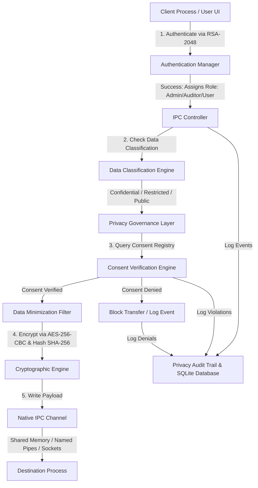

# **Resume-Ready Project Description & Interview Prep Guide**

This guide provides professional material matching the **Privacy Analyst Intern** role at **Demandbase**. It frames the **Secure Inter-Process Communication (IPC) Framework** with its **Privacy Governance Layer** as a production-grade enterprise project.

---

## **1. Resume-Ready Project Description**

### **Project Title: Privacy-Preserving Secure Inter-Process Communication (IPC) Framework**

**Key Bullet Points for Resume:**
- **Architected & Developed** a secure, cross-platform (Windows/Linux) IPC system in C++ implementing native Shared Memory, Sockets, and Named Pipes, incorporating cryptographic primitives (AES-256-CBC, RSA-2048, and SHA-256) for confidentiality, authenticity, and message integrity.
- **Engineered a Privacy-by-Design Governance Layer** featuring Role-Based Access Control (RBAC), a Consent Registry, and a Data Classification Engine (Public, Internal, Confidential, Restricted) to restrict IPC payloads at runtime before memory/socket serialization.
- **Automated Regulatory Compliance Controls** mapped to GDPR (Article 25 - Data Minimization) and DPDPA (India - Consent Verification) frameworks, reducing data exposure risks by implementing automatic payload sanitization and SHA-256 pseudonymization.
- **Designed a High-Fidelity Web Simulation Dashboard** (HTML5/CSS3/Vanilla JS) utilizing translucent glassmorphism aesthetics, interactive SVG-conduit animations, DSR (Data Subject Rights) lifecycle triggers, and real-time MITM threat/leak visual analysis.
- **Implemented a Structured SQLite Audit Engine** tracking consent state transitions, failed access authorizations, and automated data retention policies, generating cryptographically verified audit trails for compliance validation.

---

## **2. Technical Architecture Overview**

The following block diagram represents how data flows and how the **Privacy Governance Layer** intersects the standard **Security & IPC Layers**:

---

## **3. Comprehensive Interview Explanation Guide**

### **Q1: How does a "Secure IPC" system relate to the role of a Privacy Analyst?**
**Answer:**  
"In enterprise B2B settings like Demandbase, data is frequently moved between microservices, database processes, and caching servers. Standard IPC mechanisms (like shared memory or Unix pipes) are highly vulnerable to local eavesdropping and process hijacking. As a Privacy Analyst, my focus is not just on network security, but on *Privacy-by-Design* at the system call level. 

By building this project, I demonstrated how to enforce GDPR and DPDPA compliance directly in the IPC channel. For instance, before a process writes Restricted business data to a shared memory block, the system automatically checks if the destination process has the correct role (RBAC) and if the data subject's consent is active. If not, the transaction is rejected or minimized *before* it enters transit. This ensures compliance is not just an afterthought, but hardcoded into the kernel/OS-level process channels."

---

### **Q2: Can you explain the difference between your Windows and Linux IPC implementations?**
**Answer:**  
"Shared memory and pipes are completely platform-dependent. 
- On **Windows**, I used the Windows API. For shared memory, this meant utilizing `CreateFileMappingA` and `MapViewOfFile` to create segments backed by the system paging file. For named pipes, I used `CreateNamedPipeA` and `ConnectNamedPipe` in byte-stream blocking mode.
- On **Linux**, I used POSIX system calls. For shared memory, this involved `shm_open`, `ftruncate`, and mapping the file descriptor into the virtual address space using `mmap`. For named pipes, I used standard FIFOs created via `mkfifo` and read/written using Unix file descriptors.

By encapsulating these inside conditional preprocessor macros (`#ifdef _WIN32`), I created a single C++ codebase that compiles and runs natively on both platforms."

---

### **Q3: What specific compliance controls does this project implement for GDPR and DPDPA?**
**Answer:**  
"This project maps code structures directly to compliance articles:
- **GDPR Article 25 (Privacy-by-Design & Default)**: The IPC channel defaults to 'Restricted' mode with 'Least Privilege Access'. Standard processes cannot view raw data unless they specifically authenticate with high-privilege credentials.
- **GDPR Article 5(1)(c) (Data Minimization)**: If a destination process lacks authorization for 'Confidential' data, the payload is dynamically minimized (e.g., stripping PII or converting identifying fields into SHA-256 hashes) before transmission.
- **DPDPA Section 6 (Consent Registry)**: No process-to-process data transfer of personal data is initiated without verifying consent status in the local SQL registry. If consent is toggled off, the transmission triggers a 'Consent Violation' incident log.
- **GDPR Article 15/17 (DSR Management)**: The framework supports automated Data Subject Rights (DSR). When a user requests deletion (Right to be Forgotten), the system executes memory sweeps and database updates to purge the target subject's records."

---

### **Q4: How did you implement the cryptography layer?**
**Answer:**  
"The cryptography layer is split:
1. **Authentication (RSA-2048)**: Processes authenticate their identity using asymmetric key pairs. This prevents rogue processes from registering as valid pipe clients or memory readers.
2. **Confidentiality (AES-256-CBC)**: Payloads are encrypted symmetrically before being written to the IPC channel. Even if a local adversary attaches a debugger or hooks into the shared memory segment, they only read high-entropy ciphertext.
3. **Integrity (SHA-256)**: Along with the ciphertext, a SHA-256 signature is calculated. The receiver hashes the incoming payload and compares it to the signature to detect any packet tampering or corruption."
